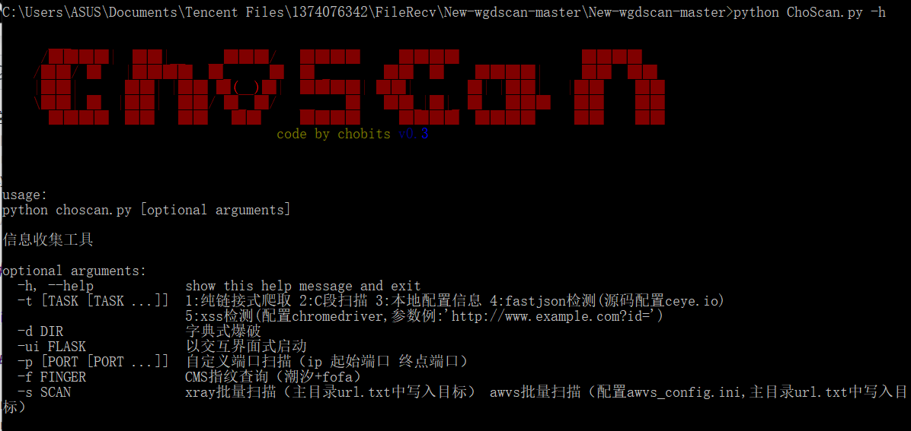

    

matoi 是一个在Linux / Windows平台下运行的信息收集、漏洞应急工具

这个项目的名字来源于

TRIGGER公司所制作的原创动画《KILL la KILL（斩服少女）》的<a href="https://zh.moegirl.org.cn/%E7%BC%A0%E6%B5%81%E5%AD%90">缠流子(Matoi Ryuuko)</a>

## matoi声明

### 本工具旨在辅助安全测试，请勿用于非法用途

- matoi 是作者的毕业设计，当前还在beta阶段。
- matoi 不会对使用者收取额外的费用，版权属于整个开源社区

## matoi功能

matoi目前beta版本暂时支持单个URL/IP查询
请下载release进行使用

- 爬虫
- 目录爆破
- 端口探测
- C段探测
- 子域名探测
- fastjson检测
- xss探测
- 指纹识别
- 漏洞扫描(AWVS需要自行安装)
- 漏洞告警

## 演示

工具默认以控制台终端启动，开启交互界面使用-ui FLASK

交互界面由于端口扫描的局限性，引入了fofa的链接，作为单个URL探测的参考

## 安装使用

- 安装Mysql数据库，并在mysql数据库创建用户root，密码为空（或是修改root密码为空）
- source 数据库文件目录下的sql文件 进入mysql控制台安装数据库依赖
- pip install -r requirements.txt 安装python依赖（可能不完整，需要后续自行安装）
- (非必要)在二级目录下新建 __ init __ .py
- python choscan.py 终端界面启动工具

## 鸣谢

> [Flask 页面模板](https://github.com/Donvink/Spider.BC) 应用Python爬虫、Flask框架、Echarts、WordCloud等技术将豆瓣租房信息爬取出来保存于Excel和数据库中，进行数据可视化操作、制作网页展示。

> [Dirscan目录扫描工具](https://github.com/j3ers3/Dirscan) A simple and fast directory scanning tool for pentesters.

> [TideFinger](https://github.com/TideSec/TideFinger) 指纹识别小工具，汲取整合了多个web指纹库，结合了多种指纹检测方法，让指纹检测更快捷、准确。

> [Python-Wappalyzer](https://github.com/chorsley/python-Wappalyzer) Python implementation of the web application detection utility.

> [Xray](https://github.com/chaitin/xray) 长亭科技的一款功能强大的安全评估工具。

> [2021HVV-exploit](https://github.com/smallpiggy/2021HVV-exploit) 2021hvv漏洞exp。

> [Pocsuite3](https://github.com/knownsec/pocsuite3) Pocsuite3漏扫框架

## Star History

## 欢迎加入知识星球分享安全&开发知识

